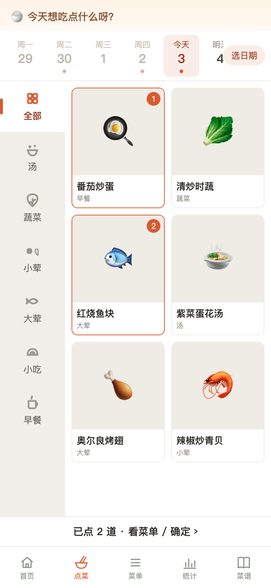
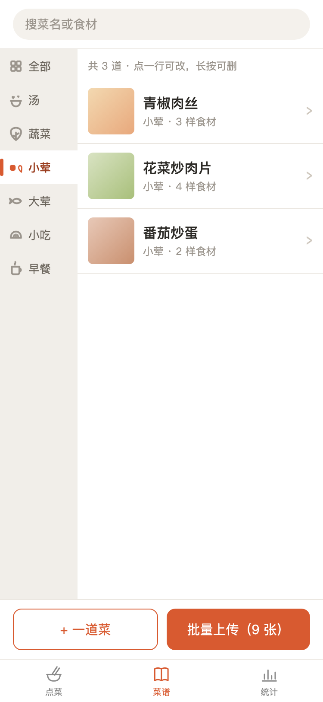

# 家庭点餐小程序 · Family Meals

> 一款妈妈写给 10 岁儿子的点餐小程序：**先点明天的菜，再去买菜**。
> 代码开源、零配置即可运行，支持「本地存储 / 微信云开发」两种模式，照片可免费存云端。





## 这是什么
给家庭日常用的点餐工具：妈妈（或孩子）提前把想吃的菜点好，生成「某天吃什么」的菜单，再去买菜不漏东西。

- **菜谱页**：管理「会做的菜」——分类、配料、封面图，可上移/置顶排序。
- **点菜页**：按日期点菜，日期条 + 「更多」日历，左右分类联动，常吃点前置，可清空。
- **菜单页**：按日期查看已点菜单，可删除某一天（带二次确认）。
- **统计页**：按菜 / 分类统计。

## 功能一览
- 首页：封面 + 三大入口（点菜 / 菜谱 / 统计）
- 点菜页：日期条（今天 / 明天 / 后天 … + 「更多」日历）、左右分类联动、常吃点前置、清空（右上角）
- 菜谱页：分类分组、搜索、上移/置顶手动排序、增删改、上传封面图（自动压缩到长边 1080）
- 菜单页：按日期查看已点菜单、删除某一天（二次确认）
- 两种存储：**本地（零配置）/ 微信云开发（免费云存储 + 多端同步）**

## 目录结构
```
family-meals/
├─ project.config.json        # 微信开发者工具项目配置（已指向 miniprogram/）
├─ miniprogram/               # ← 小程序源码都在这
│  ├─ app.js / app.json / app.wxss
│  ├─ config.js               # 全局配置（分类、云环境开关、图片压缩）
│  ├─ images/                 # tabBar / 分类图标 / 封面（已内置）
│  ├─ pages/                  # home / order / dishes / meals / stats
│  └─ utils/                  # store(数据) / upload(图片) / util(工具)
├─ tools/                     # 开发辅助脚本（生成图标、自检、预览页）
├─ docs/screenshots/          # 截图（本文件用）
└─ preview-changes.html       # 改动总览页（tools/preview-changes.js 生成）
```

## 快速开始（本地模式，零配置，立刻能跑）
1. 安装 [微信开发者工具](https://developers.weixin.qq.com/miniprogram/dev/devtools/download.html)（稳定版）。
2. 打开开发者工具 → **导入项目** → 目录选 **family-meals 这个文件夹** → 填你的 AppID（见下）→ 导入。
3. 直接点「编译」，模拟器里就能用。手机上点「预览」扫二维码即可真机使用。
4. 默认就是**本地模式**：数据存在手机本机，**不配云也能把全部功能跑一遍**。

> **AppID**：项目当前内置的 `wx00de802bba8dd8c5` 属于**小程序测试号**（开发者工具的临时沙箱）。
> 本地模式跑完全没问题，但测试号**不能上传代码、也不能用云开发**（这两个按钮会是灰的）。
> 想让照片免费存云端，见 👉 [docs/cloud-storage-guide.md](./docs/cloud-storage-guide.md)。

## 两种数据存储模式
| | 本地模式（默认） | 云模式（微信云开发） |
|---|---|---|
| 配置 | 零 | 一次性填云环境 ID |
| 数据存哪 | 手机本机 | 微信免费云空间 |
| 换手机 / 重装 | 会丢，需重录 | 自动跟过来 |
| 适合 | 先试流程 | 长期家庭自用 |

切换只需在 `miniprogram/config.js` 把 `cloudEnv: ''` 改成你的云环境 ID（见下）。

## 如何开启「免费云存储」（照片免费存云端）

> ⚠️ **前置条件**：如果开发者工具里「云开发」「上传」按钮是**灰色**的，说明当前项目挂在**小程序测试号**上
> （测试号不支持云开发）。请先看 [docs/cloud-storage-guide.md](./docs/cloud-storage-guide.md) 换成正式 AppID，
> 再按下面步骤操作。

你上传的菜谱封面图，**代码已经支持直接存到「微信云开发 · 云存储」（免费额度），不需要改任何代码**，只要打开云模式：

1. 微信开发者工具顶部点「**云开发**」→ 开通 → 按提示创建一个环境（选**免费/基础**档），得到环境 ID（形如 `cloud1-xxxxxxxx`）。
   - 可能需要做一次微信实名（身份证），是微信的标准要求，家庭个人使用没问题。
2. 云开发控制台 → 数据库 → 新建集合 **dishes** 和 **orders**。
3. 这两个集合的权限都改成「**仅创建者可读写**」（别设成公开：否则别人能往你库里灌数据，或你自己写不进去）。
4. 打开 `miniprogram/config.js`，把 `cloudEnv: ''` 改成 `cloudEnv: 'cloud1-xxxxxxxx'`。
5. 重编译小程序。之后在菜谱页上传的图，就自动进微信免费云存储，换手机也不丢。

**免费额度够用吗？** 云开发基础版免费额度含：云存储约 **5GB**、云数据库约 **2GB**，以及每日一定量的云函数 / 读写次数（以微信官方最新公告为准）。家庭几十道菜 + 照片，几年都用不完，**完全不用付费**。

> 提示：开启云模式后，手机上**之前本地录入的菜谱不会自动搬家**到云端；如需迁移，可在云开发控制台手动导入，或后续二次开发时再加。

## 真机使用 & 要不要发布
- **家庭自用不需要发布 / 上架**：开发者工具里点「预览」生成二维码，微信扫一扫就能在手机上用，随时能扫。
- 想要固定入口，可点「上传」→ 设为「体验版」，家里人都能用体验版（仍免认证）。
- 正式上架到微信搜索需要 **微信认证（300 元/年）**，家庭自用通常没必要。

## 提交到 GitHub / 二次开发
本仓库已在本地打好版本 **v1.0.0**（见 `git tag`）：代码已 `git init`、提交、打标签。你只需把它推到自己的 GitHub，即可备份和二次开发。

**方式一（推荐，图形界面，最简单）— GitHub Desktop：**
1. 去 github.com 注册一个**免费**账号（约 5 分钟）。
2. 安装 [GitHub Desktop](https://desktop.github.com/) → 登录。
3. File → Add Local Repository → 选 `family-meals` 文件夹 → Add。
4. 右上角 Publish → Repository name 填 `family-meals` → 选 **Private（私有，仅自己可见，更安全）** → Publish。
5. 以后改完代码，写一句总结 → Commit → Push 即可。

**方式二（命令行）：**
```bash
# 在 family-meals 目录下
git remote add origin https://github.com/<你的用户名>/family-meals.git
git branch -M main
git push -u origin main
git push --tags
```
推上去后，在 GitHub 页面点 **Releases → Draft a new release → 选 v1.0.0 标签 → 发布**，就是一个正式的版本页。

**二次开发：** 把仓库 clone 下来，改 `miniprogram/` 里的页面 / 样式即可。本地模式零配置就能跑；要接云就把 `config.js` 的 `cloudEnv` 填上。

## 版本与升级
- 当前稳定版：**v1.0.0**（2026-10-03）。
- 改动记录见 [CHANGELOG.md](./CHANGELOG.md)。
- 约定（后续参考）：功能有变化就 `git commit` 并 `git tag vX.Y.Z`（语义化版本：大功能升主版本，小修小补升补丁），再推 GitHub。

## 常见问题
**Q：不配云，能用吗？** 能。默认本地模式，零配置，数据在手机本机，只是换手机 / 重装会丢。

**Q：照片免费存云端要花钱吗？** 不要。用微信云开发免费额度（云存储 5GB）即可，详见上文「免费云存储」。

**Q：GitHub 是存照片的吗？** 不是。GitHub 只存**代码**（方便备份和二次开发）；照片走微信云存储（免费）。两者各管一摊。

**Q：别人能看到我的菜谱吗？** 不会。代码在私有 GitHub 仓库；数据在微信云存储且集合权限是「仅创建者可读写」。

**Q：AppID 能随便换吗？** 一个 AppID 对应一个小程序。当前 `wx00de802bba8dd8c5` 是**测试号**，只够本地跑；
要上传 / 用云开发必须换成正式小程序（个人主体免费注册）。注意换号后**本机已录入的菜谱在新号下看不到**
（本地存储按 AppID 隔离），需重新录入一次。

**Q：云开发按钮是灰的怎么办？** 见 [docs/cloud-storage-guide.md](./docs/cloud-storage-guide.md)，
一句话：当前是测试号，换成正式小程序即可（免费，约 10 分钟）。

## 许可
[MIT](./LICENSE) © 2026 家庭点餐小程序作者
